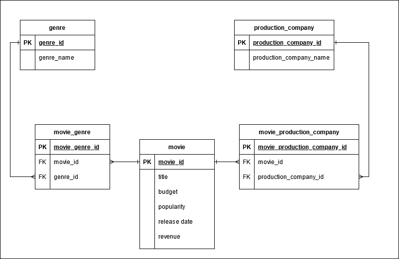

# How To Run

1. Start up docker and create movie DB inside of it
    - from the main directory - **guild-data-engineer-project**
    - `docker-compose up -d`
2. Make sure you're authenticated to AWS to avoid errors or warnings
3. Install project using maven
    - `mvn clean install`
4. Run the shell script, providing S3 endpoint as argument
    - Note: check the permissions of **run.sh** - use chmod if necessary so it's executable
    - `./run.sh "s3://com.guild.us-west-2.public-data/project-data/the-movies-dataset.zip"`
5. Output files will end up in **guild-data-engineer-project/working_directory/movie_result**s
6. Logs will end up in **guild-data-engineer-project/log**
    - Exact output files are stated in the main log - **data-engineer-project.log**
7. After project has finished running, shut down docker
    - `docker-compose down`

# ERD Diagram

# Modeling Decision

1. The given data fits into a relational database with minimal cleanup.
    1. There are three main data entities - a movie, a genre, and a production company.
    2. To avoid many-to-many relationships, a table is used to tie a genre and a production company
       to a movie.
2. Tech Stack
    1. **Postgres** - Postgres is a free relational database, but it can also be very powerful.
        1. It can handle very large tables if partitioning is added.
    2. **Java** - I went with Java because I am most familiar with it, and because it is powerful
       and capable of handling large amounts of data.
    3. **Maven** - I went with the maven build tool, as that's the one I'm familiar with.
    4. **Docker** - The database for this project runs inside a docker container, so that it doesn't
       mess up anyone's local install.

# Future Needs

## 100x Increase

Solutions for a 100x increase in data volume, and an hourly update cadence:

1. We can continue using the Postgres DB for movie data, since it isn't too complex.
    1. Also, even if we're expecting 100x increase, I would assume this data to grow linearly from
       that point on (so, a similar amount of data sent each hour) - since I would expect movies
       made per year to stay about the same.
2. Postgres is capable is handling larger amounts of data, but partitioning needs to be added to the
   tables.
    2. A good way of partitioning tables would be to add a timestamp column and using it. With a
       known hourly cadence, we expect about 24 files a day - we can choose to create a new
       partition each week.
    3. For the sake of this exercise, I create a new, clean DB each time. This will not work in the
       new scenario. Instead, a more permanent database should be set up.
2. Java code - my code right now is quite simple and works for the exercise. To scale it:
    1. Break the application down into parts - a reader, a worker, and a writer part
        1. As each part processes records, it will put them onto a queue, then the next part can
           pick it up
    2. Add multithreading to this application to speed up processing.
3. Overall process - we would set up a workflow in a tool such as airflow to run automatically.
    1. Downloading and unzipping the file takes the longest. This can be pulled out into a
       completely separate workflow to stage files for us. This can be run on an hourly cadence.
    2. The rest of the program - uploading data to the database and pulling results is quicker and
       can be done more rarely, for example once a day. This will allow us to keep the server free
       for other jobs.
    3. If broken up in such a way, the input to the first process would be the s3 endpoint and the
       stage location. The second process will then pick up all the complete files in this location,
       process them, and move them to an archive.

## Data Reprocessing

To backfill a year's worth of data, avoiding impact on current production flow we could pull it down
and stage it separately. Since this doesn't touch the DB, it could be done simultaneously with the
rest of the workflow. Assuming we run our regular data upload daily, backfilling can be fitted in at
a different time. We could also break up the files into smaller chunks (such as to the size of a
normal daily run) and slot them in as needed.

However, whether this needs to be done as one large chunk, or several smaller chunk would be a team
decision that would depend on how the data is being used downstream. The deciding factors would be
if it is better to interrupt the normal data flow for a single large period of time to finish the
backfill, or if uploading the data between other jobs is best. Depending on the decision, we can add
the files for backfilling to the normal staging location and let the existing process handle it.

## Error Handling

There are several considerations when it comes to error-handling:

1. Validating the incoming data to make sure bad data doesn't cause errors
    1. Create a validator util that will apply rules to each piece of data
2. Handling a process breakdown
    1. The airflow process should send an email (or another alert type) when the hourly process
       doesn't finish without error - whether there is an authentication failure or another issue.
    2. Manual intervention would be needed at that point to correct the issue, and kick the job off
       again.
